# Design Patterns CheatSheet
My personnal cheatsheet for design patterns, created with PlantUML. I created it while learning about them, if you find any error/typos, please report an issue.

Here are some good resources about design patterns.

- [Design Patterns in Object Oriented Programming by Christopher Okhravi's (YouTube Playlist)](https://www.youtube.com/playlist?list=PLrhzvIcii6GNjpARdnO4ueTUAVR9eMBpc)
- [Head First Design Patterns (Book, Oreilly)](https://www.oreilly.com/library/view/head-first-design/0596007124/)
- [Understanding The Visitor Design Pattern by The Simple Engineer (YouTube)](https://www.youtube.com/watch?v=TeZqKnC2gvA)
- [Game Programming Patterns (Free web-based book)](https://gameprogrammingpatterns.com/contents.html)

## Structural patterns

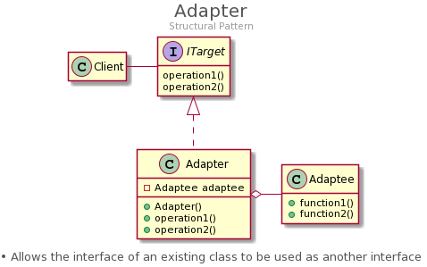

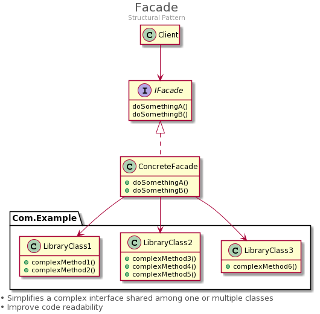

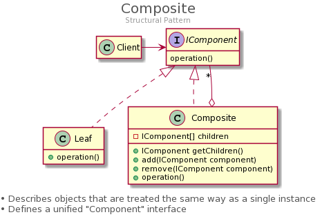

## Creational patterns

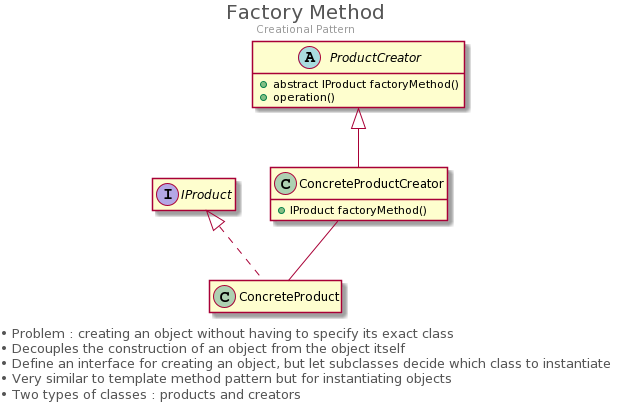

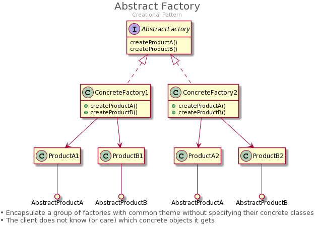

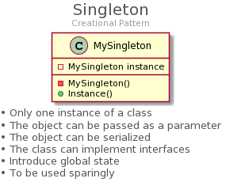

## Behavioral patterns

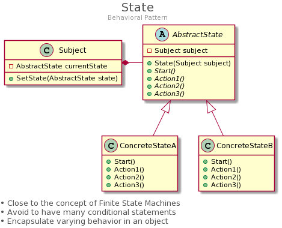

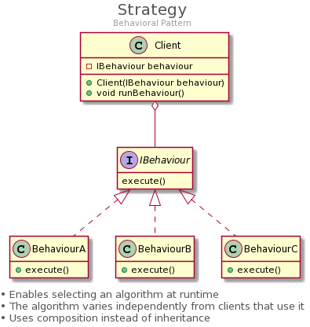

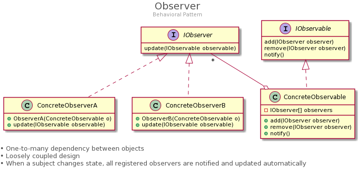

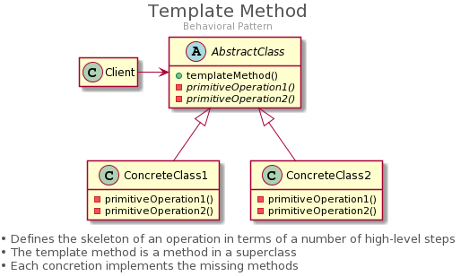

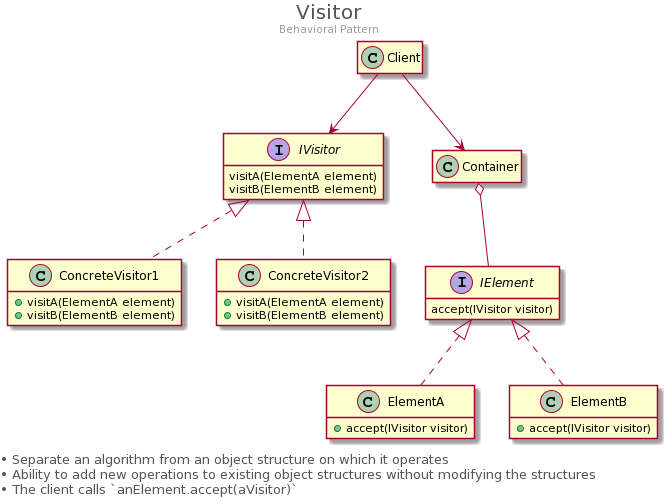

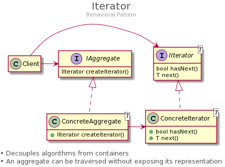

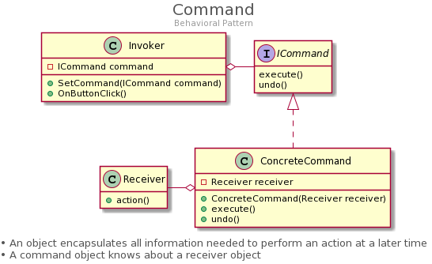
